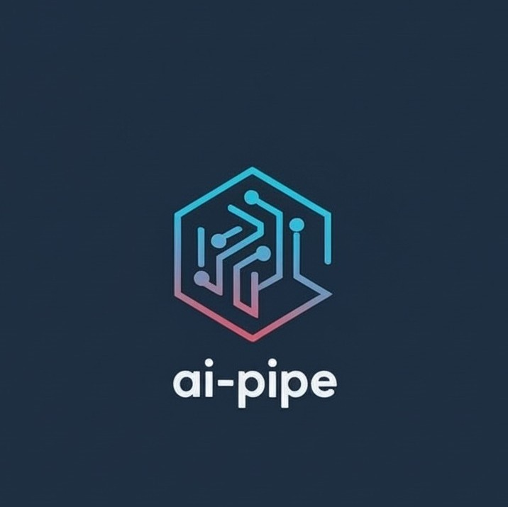

# AI Pipe

<p align="center">
   <br/>
</p>

<p align="center">
  A high-performance, lightweight C++20 pipeline framework based on DAG execution model.<br/>
  Zero third-party dependencies · Microsecond-level latency · Batch & Streaming modes
</p>

<p align="center">
  <b>Version 0.5.0</b> · Author: <a href="mailto:sintercver@gmail.com">Sinter Wong</a>
</p>

---

## Overview

AI Pipe is a data flow processing framework designed for AI pipeline scenarios such as deep learning inference, video processing, and high-throughput data streaming. It models computation as a **Directed Acyclic Graph (DAG)**, where each node represents a processing unit and edges define data dependencies between them.

The framework provides two primary execution modes — **Batch** for single-pass DAG execution and **Stream** for continuous real-time processing with backpressure management — along with a strategy-pattern architecture that allows users to plug in custom scheduling, synchronization, and drop policies without modifying the core engine.

### Key Features

- **DAG-Based Execution**: Model complex processing pipelines as directed acyclic graphs with automatic topological scheduling and parallel execution of independent branches.
- **Dual Execution Modes**: Batch mode for one-shot processing and Streaming mode for continuous data flow with configurable backpressure and frame dropping.
- **Strategy Pattern Architecture**: Pluggable `ISchedulerStrategy` and `ISyncStrategy` interfaces for custom scheduling and multi-stream synchronization.
- **Lock-Free Core Queue Paths**: High-performance MPMC queue based on Vyukov's algorithm with cache-line aligned slots and integrated drop policies, targeting <100ns per operation. The core push/pop paths are lock-free; `tryPeek` and producer-side evictions (DropHead/KeepLatest) are serialized by a small head mutex to keep peek-vs-evict race-free.
- **Work-Stealing Thread Pool**: Per-worker local queues with LIFO execution for cache locality and FIFO stealing for fairness.
- **Unified Error Handling**: `Result<T>` monadic type replaces mixed bool/exception patterns with zero-overhead success path and rich error context (code + message + node name).
- **Zero Third-Party Dependencies**: Built entirely on C++20 standard library (requires compiler support for `<atomic>`, `<shared_mutex>`, `<any>`, `<optional>`, etc.).
- **PIMPL Idiom**: Clean public API with hidden implementation details, ensuring stable ABI and fast compilation.
- **Observability**: Live execution/drop/throughput statistics, a 16-bucket end-to-end latency histogram with p50–p99.9 percentile reporting, queue wait/pop counters, and per-node statistics.

---

## Architecture

```
┌─────────────────────────────────────────────────────────────────────┐
│                        Pipeline (Public API)                       │
│   PipelineBuilder → Pipeline → run() / start() / pushInput()      │
├─────────────────────────────────────────────────────────────────────┤
│                       ExecutionEngine (Core)                       │
│   ┌──────────────┐   ┌──────────────┐   ┌───────────────────────┐  │
│   │  IScheduler  │   │    ISync     │   │   Lock-Free MPMC      │  │
│   │  Strategy    │   │   Strategy   │   │   Queue (per-node)    │  │
│   └──────────────┘   └──────────────┘   └───────────────────────┘  │
│   ┌──────────────────────────────────────────────────────────────┐  │
│   │            Work-Stealing Thread Pool                         │  │
│   └──────────────────────────────────────────────────────────────┘  │
├─────────────────────────────────────────────────────────────────────┤
│                           DAG Graph                                │
│   ┌──────┐    ┌──────┐    ┌──────┐    ┌──────┐                     │
│   │NodeA │───►│NodeB │───►│NodeD │───►│NodeE │  (topological order)│
│   └──────┘    └──────┘    └──────┘    └──────┘                     │
│                  │                       ▲                          │
│                  └──────►┌──────┐────────┘                         │
│                          │NodeC │   (parallel branches / join)      │
│                          └──────┘                                  │
├─────────────────────────────────────────────────────────────────────┤
│                      PipelineContext                                │
│   Resources · Services · Metrics · Cancellation · Logger Adapter   │
└─────────────────────────────────────────────────────────────────────┘
```

### Core Components

| Component | Header | Description |
|-----------|--------|-------------|
| `Pipeline` / `PipelineBuilder` | `pipeline.hpp` | High-level fluent API for building and running pipelines |
| `ExecutionEngine` | `execution_engine.hpp` | Core engine supporting batch and stream modes |
| `Graph` / `Edge` | `graph.hpp`, `edge.hpp` | DAG topology with cycle detection, adjacency tracking |
| `ILogicNode` | `i_logic_node.hpp` | Abstract processing node interface |
| `PipelineContext` | `context.hpp` | Thread-safe shared context: resources, metrics, cancellation |
| `ISchedulerStrategy` | `i_scheduler_strategy.hpp` | Pluggable scheduling policy interface |
| `ISyncStrategy` | `i_sync_strategy.hpp` | Pluggable frame synchronization interface |
| `Result<T>` / `Error` | `error.hpp` | Monadic error handling with categorized error codes |
| `DataPacket` | `data_packet.hpp` | Type-erased key-value data container for inter-node communication |
| `IFrameMetadata` | `frame_metadata.hpp` | Frame identification and multi-stream synchronization |
| `LockFreeQueue` | `lock_free_queue.hpp` | Bounded MPMC queue with drop policy support |
| `WorkStealingThreadPool` | `work_stealing_thread_pool.hpp` | High-performance thread pool with work stealing |

### Optional Components

- `ai_pipe::config` provides the JSON graph loader without introducing JSON
  into the core library. Enable it with `AI_PIPE_BUILD_CONFIG=ON` and link the
  component explicitly; see [JSON Graph Loader](docs/JSON_Graph_Loader.md).
- Node implementations can be built as resident shared-library plugins with
  explicit, transactional registration and stable type IDs; see the
  [Node Plugin Guide](docs/Plugin_Guide.md).
- Scheduler and synchronization policies remain ordinary strategy objects.
  They are runtime behaviors owned by a pipeline, rather than global plugin
  registrations, so applications can inject custom implementations directly.

### Packet Ownership Model

Packets flowing through the graph are **immutable**. Create a packet with
`std::make_shared<PortData>()` (a `MutablePortDataPtr`), fill it, and hand
it to the pipeline — from then on every consumer shares the same read-only
object (`PortDataPtr` is `shared_ptr<const PortData>`), which is what makes
zero-copy fan-out to parallel branches race-free. A node that needs to
modify a received packet uses `ai_pipe::mutableCopy(packet)` — an explicit
copy-on-write escape hatch that leaves the original untouched for sibling
consumers.

---

## Quick Start

### 1. Define Processing Nodes

Inherit from `ILogicNode` and implement the `process()` method:

```cpp
#include <ai_pipe/ai_pipe.hpp>

class PreprocessNode : public ai_pipe::ILogicNode {
public:
    PreprocessNode() : ILogicNode("preprocess") {}

    void process(const ai_pipe::PortDataMap& inputs,
                 ai_pipe::PortDataMap& outputs,
                 std::shared_ptr<ai_pipe::PipelineContext> context) override {
        // Read input (Result-based access: no exceptions)
        auto input = inputs.at("image");
        auto raw = input->param<std::vector<uint8_t>>("raw_data").value();

        // Process...
        auto result = std::make_shared<ai_pipe::PortData>();
        result->id = input->id;
        result->setParam("tensor", preprocessed_tensor);

        outputs["tensor"] = result;
    }

    std::vector<std::string> getExpectedInputPorts() const override {
        return {"image"};
    }

    std::vector<std::string> getExpectedOutputPorts() const override {
        return {"tensor"};
    }
};
```

### 2. Build the DAG Graph

```cpp
ai_pipe::Graph graph;

auto preprocess = std::make_shared<PreprocessNode>();
auto infer      = std::make_shared<InferenceNode>();
auto postproc   = std::make_shared<PostprocessNode>();

graph.addNode(preprocess);
graph.addNode(infer);
graph.addNode(postproc);

// Define data flow: preprocess → inference → postprocess
graph.addEdge("preprocess", "tensor",  "inference",   "input");
graph.addEdge("inference",  "result",  "postprocess", "detection");
```

### 3a. Batch Execution

```cpp
// Build pipeline via builder pattern
auto result = ai_pipe::Pipeline::create()
    .withGraph(std::move(graph))
    .withMode(ai_pipe::ExecutionMode::BATCH)
    .withWorkers(4)
    .build();

if (!result) {
    std::cerr << "Build failed: " << result.error().toString() << std::endl;
    return;
}

auto pipeline = std::move(result).value();

// Prepare input data
ai_pipe::PortDataMap inputs;
auto data = std::make_shared<ai_pipe::PortData>();
data->setParam("raw_data", image_bytes);
inputs["image"] = data;

// Run and get output
auto output = pipeline.run(inputs);
if (output) {
    auto& results = output.value().outputs;
    auto elapsed  = output.value().elapsed;
    // Process results...
} else {
    std::cerr << "Execution failed: " << output.error().toString() << std::endl;
}
```

Or use the convenience factory:

```cpp
auto result = ai_pipe::makeBatchPipeline(std::move(graph), 4);
```

### 3b. Streaming Execution

```cpp
auto result = ai_pipe::makeStreamPipeline(std::move(graph), 4, 16);
auto pipeline = std::move(result).value();

// Register callbacks
auto observer = std::make_shared<ai_pipe::CallbackObserver>();
observer->onResult([](const ai_pipe::PortDataMap& outputs) {
    // Handle each frame result...
}).onError([](const ai_pipe::Error& error) {
    std::cerr << error.toString() << std::endl;
}).onDrop([](const std::string& node, uint64_t frame_id, const std::string& reason) {
    std::cerr << "Frame " << frame_id << " dropped at " << node
              << ": " << reason << std::endl;
});

pipeline.addObserver(observer);

// Start streaming
pipeline.start();

// Continuously push data
for (auto& frame : video_stream) {
    auto data = std::make_shared<ai_pipe::PortData>();
    data->setParam("raw_data", frame);

    auto status = pipeline.pushInput("preprocess", data);
    if (status && status.value().isDropped()) {
        // Backpressure: a frame was evicted
    }
}

// Graceful shutdown
pipeline.stop(/*wait_for_drain=*/true);
```

---

## Error Handling

AI Pipe uses a unified `Result<T>` type for all fallible operations, replacing the previous mix of bool returns and exceptions.

### Error Code Categories

| Range | Domain | Examples |
|-------|--------|----------|
| 0xx | General | `Ok`, `InternalError` |
| 1xx | Configuration | `InvalidArgument`, `GraphCycleDetected`, `GraphEmpty` |
| 2xx | Execution | `AlreadyRunning`, `ExecutionFailed`, `ExecutionTimeout` |
| 3xx | Queue / Streaming | `NotStreaming`, `QueueFull`, `NodeNotFound`, `PortNotFound` |
| 4xx | Node-level | `NodeException`, `InputUnavailable` |

### Usage Patterns

```cpp
// Check with if
auto result = pipeline.run(inputs);
if (result) {
    use(result.value());
} else {
    handle(result.error());        // Error with .code(), .message(), .nodeName()
}

// Use value_or for defaults
auto output = pipeline.run(inputs).valueOr(default_output);

// Check specific error codes
if (result.errorCode() == ai_pipe::ErrorCode::ExecutionTimeout) {
    // Retry logic...
}
```

---

## Pipeline Context

`PipelineContext` provides a thread-safe shared execution environment with the following capabilities:

- **Resource Management**: Register and retrieve named resources (models, engines) with type-safe `setResource<T>()` / `getResource<T>()`.
- **Service Registry**: Type-indexed service locator via `setService<Interface>()` / `getService<Interface>()`.
- **Configuration Store**: Thread-safe key-value configuration with `setConfig<T>()` / `getConfig<T>()`.
- **Execution Metrics**: Automatic per-node timing, success rate tracking, and aggregated `ExecutionMetrics`.
- **Cooperative Cancellation**: `CancellationToken` polled at engine scheduling points; long-running nodes check `isCancellationRequested()` for clean shutdown.
- **Logger Adapter**: Bridge to external logging systems (glog, spdlog) via `ILoggerAdapter` interface.
- **Progress Reporting**: Per-node `ProgressReporter` with callback support.

```cpp
auto ctx = std::make_shared<ai_pipe::PipelineContext>();

// Register shared resources
ctx->setResource("model", model_ptr);
ctx->setService<IInferenceEngine>(engine_ptr);

// Configure logger
ctx->setLoggerAdapter(std::make_shared<MyGlogAdapter>());

// Use in pipeline
auto pipeline = ai_pipe::Pipeline::create()
    .withGraph(std::move(graph))
    .withContext(ctx)
    .withOptions(ai_pipe::PipelineOptions::batch())
    .build();
```

---

## Strategy System

### Scheduler Strategies

The `ISchedulerStrategy` interface controls when nodes execute and what "completion" means:

| Strategy | Mode | Behavior |
|----------|------|----------|
| `BatchSchedulerStrategy` | Batch | Execute when all inputs ready; complete when all sinks finish once |
| `StreamSchedulerStrategy` | Stream | Continuous execution; reschedule nodes after completion |

Custom strategies can be injected:

```cpp
auto pipeline = ai_pipe::Pipeline::create()
    .withGraph(std::move(graph))
    .withSchedulerStrategy(std::make_unique<MyCustomScheduler>())
    .build();
```

### Synchronization Strategies

The `ISyncStrategy` interface handles frame alignment across parallel DAG branches:

| Strategy | Behavior |
|----------|----------|
| `NoSyncStrategy` | No synchronization (default for batch) |
| `JoinAwareSyncStrategy` | Auto-detected sync groups at DAG join nodes with drop propagation and watermark tracking |

> Since Phase 4, the engine fully drives these strategies: multi-input
> nodes receive frame-aligned inputs (lagging frames whose partners were
> dropped on sibling branches are discarded and reported), tracked path
> nodes honor coordinated drops early via `shouldDrop`, and successful
> executions advance the group watermark via `markProcessed`.

---

## Frame Metadata & Synchronization

For streaming scenarios with multiple input sources, AI Pipe provides `IFrameMetadata` to enable frame-level synchronization:

- **`BasicFrameMetadata`**: Synchronizes by exact frame ID match. Suitable for single-source or ID-aligned multi-source.
- **`TimestampFrameMetadata`**: Synchronizes by timestamp proximity (configurable tolerance, default 33ms). Ideal for multi-camera systems.
- **`FrameMetadataFactory`**: Generates auto-incrementing frame IDs and end-of-stream markers.

---

## Observability & Metrics

### Engine Statistics

Access real-time metrics via `pipeline.statistics()`:

```cpp
auto stats = pipeline.statistics();

stats.success_rate;           // Execution success rate (%)
stats.throughput;             // Frames per second
stats.drop_rate;              // Frame drop rate (%)
stats.avgProcessingTimeUs();  // Average processing time (μs)
```

```cpp
stats.avgWaitTimeUs();        // Avg frame age at dequeue (μs)
stats.avgScheduleTimeUs();    // Avg READY-to-execution delay (μs)
```

### Latency Histogram

16-bucket end-to-end histogram from <10μs to ≥500ms, recorded when a frame
completes at a sink node:

```cpp
auto percentiles = stats.latencyPercentiles();
// {{"p50", val}, {"p90", val}, {"p95", val}, {"p99", val}, {"p99.9", val}}

auto histogram = stats.histogramData();
// {{"<10us", count}, {"<25us", count}, ..., {">=500ms", count}}
```

### Per-Node Statistics

`EngineStatisticsSnapshot::node_stats` carries per-node execution counts,
success rate, processing time (avg/min/max), input/output counts, and the
current queue depth. All statistics honor `enable_statistics = false` for
zero-overhead operation.

### Pipeline State Machine

```
UNINITIALIZED → IDLE → RUNNING → IDLE
                  ↓        ↓
               STOPPING → ERROR
```

---

## API Reference (Public Headers)

### Single Include

```cpp
#include <ai_pipe/ai_pipe.hpp>  // Includes all public API headers
```

### Pipeline Options

```cpp
// Quick configuration via factory methods
auto batch_opts  = ai_pipe::PipelineOptions::batch(4);       // 4 workers, batch mode
auto stream_opts = ai_pipe::PipelineOptions::stream(4, 16);  // 4 workers, queue cap 16
```

| Option | Type | Default | Description |
|--------|------|---------|-------------|
| `mode` | `ExecutionMode` | `BATCH` | `BATCH` or `STREAM` |
| `num_workers` | `uint8_t` | `4` | Thread pool worker count |
| `execution_timeout` | `milliseconds` | `0` (none) | Per-execution timeout |
| `queue_capacity` | `size_t` | `0` (unbounded) | Per-node input queue capacity |
| `drop_strategy` | `string` | `"DropHead"` | `"DropHead"`, `"DropTail"`, `"KeepLatest"` |
| `enable_sync_coordination` | `bool` | `false` | Enable cross-branch frame sync |
| `enable_statistics` | `bool` | `true` | Enable metrics collection |

### Key Pipeline Methods

| Method | Returns | Description |
|--------|---------|-------------|
| `run(inputs)` | `Result<ExecutionOutput>` | Synchronous batch execution |
| `run(inputs, timeout)` | `Result<ExecutionOutput>` | Batch execution with timeout |
| `runAsync(inputs)` | `future<Result<ExecutionOutput>>` | Asynchronous batch execution |
| `submit(inputs)` | `Result<void>` | Fire-and-forget execution |
| `start()` | `Result<void>` | Start streaming mode |
| `stop(wait)` | `void` | Stop streaming |
| `pushInput(node, data)` | `Result<PushStatus>` | Push data into stream |
| `cancel()` | `void` | Cancel current execution |
| `statistics()` | `EngineStatisticsSnapshot` | Get performance metrics |

---

## Project Structure

```
ai-pipe/
├── include/ai_pipe/      # Public API headers
├── src/
│   └── *.cpp, *.hpp      # Internal implementation (PIMPL), not installed
├── tests/                # Unit tests (GTest)
├── benchmarks/           # Performance benchmarks (Google Benchmark)
├── examples/             # Usage examples
├── platforms/            # Per-platform toolchain files
├── 3rdparty/             # Vendored headers (nlohmann/json, optional)
├── cmake/                # CMake modules
├── docs/                 # Documentation
├── scripts/              # Build & CI scripts
├── assets/               # Project assets (logo; not installed)
└── README.md
```

Public headers live under `include/ai_pipe/` and are installed to
`<prefix>/include/ai_pipe/`, so both the build-tree and install-tree include
interfaces are `#include "ai_pipe/…"`. Everything under `src/` is private and
never installed.

---

## Requirements

- **C++ Standard**: C++20
- **Compiler**: GCC 11+ / Clang 14+ / MSVC 19.29+
- **Build System**: CMake 3.16+
- **Runtime Dependencies**: None (pure C++20 standard library)
- **Test Dependencies** (optional): Google Test, Google Benchmark

---

## Build

```bash
mkdir build && cd build
cmake .. -DCMAKE_BUILD_TYPE=Release
cmake --build . -j$(nproc)

# Run tests
ctest --output-on-failure

# Run benchmarks
./benchmarks/ai_pipe_benchmark
```

Top-level builds run a clang-format 21 check before compiling the library.
The check is disabled by default when AI Pipe is included as a subproject.
Use the dedicated targets to check or update all first-party C++ sources:

```bash
cmake --build . --target ai_pipe_format_check
cmake --build . --target ai_pipe_format
```

If clang-format 21 is not on `PATH`, set
`AI_PIPE_CLANG_FORMAT_EXECUTABLE` to its executable. Pass
`-DAI_PIPE_FORMAT_CHECK_ON_BUILD=OFF` to disable the default-build check.

---

## License

Copyright (c) 2025-2026 Sinter Wong. All rights reserved.
